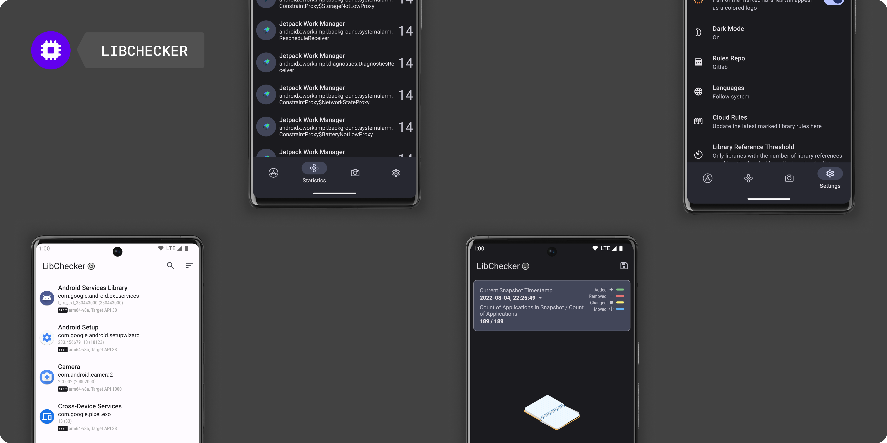

# LibChecker

## What's this?
This app is used to view the third-party libraries used by applications in your device. It can view the ABI architecture of the application's native library (in general, whether the application is 64-bit or 32-bit). It can also view well-known libraries marked by [The Rule Repository](https://github.com/zhaobozhen/LibChecker-Rules), and can even sort and view them according to the number of libraries references.

## Supported Versions
Android 7.0 ~ 13 Beta 4

Android 6 [Marshmallow](https://github.com/zhaobozhen/LibChecker/tree/marshmallow)

## Document
[LibChecker-Docs](https://github.com/zhaobozhen/LibChecker-Docs)

## Download

## Discussions
[Github Discussions](https://github.com/zhaobozhen/LibChecker/discussions)

### Telegram Group

