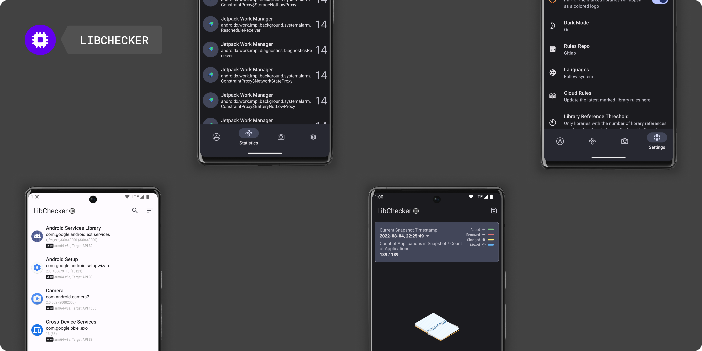

# LibChecker

LibChecker helps you inspect libraries and package details used by Android apps.
It can analyze installed apps, APK files, split packages, and app snapshots, then
present LibChecker rule matches, native library metadata, signing information,
permissions, components, and package changes in a readable interface.

## Features

- Inspect installed apps and APK/APKS-style packages, including split APKs and
  large APK download links shared to LibChecker.
- Detect well-known SDKs and libraries with
  [LibChecker-Rules](https://github.com/LibChecker/LibChecker-Rules), covering
  native libraries, components, permissions, metadata, package names, shared
  UIDs, signatures, and intent actions.
- View ABI and native library details, including 32-bit/64-bit architecture,
  multi-architecture packages, 16 KB page-size readiness, ZIP alignment, stripped
  symbol tables, and native library extraction.
- Review app package details such as manifest entries, permissions, signing
  schemes, installation source, DEX optimization status, alternative launch
  icons, themed icons, Overlay apps, and Modern Xposed API module information.
- Explore statistics for ABI distribution, Android version distribution, and
  library references across apps.
- Capture snapshots of installed apps, compare changes over time, back up or
  restore snapshots, and compare saved packages with the current installation.
- Export app information from Settings and open the exported file in WebUI for a
  visual report.

## WebUI

LibChecker also has a browser-based companion WebUI at
[lc.absinthe.life](https://lc.absinthe.life/). It is developed in the
[LibChecker/tgbot](https://github.com/LibChecker/tgbot) project together with
the Telegram bot and shared JavaScript analyzer.

The WebUI can analyze and compare Android packages in the browser with local
processing, and it can open app information exported by LibChecker.

## Supported Versions

- Android 7.0 ～ 17
- Android 6 Marshmallow users can use the
  [marshmallow branch](https://github.com/LibChecker/LibChecker/tree/marshmallow)

## Downloads

<!--  -->

## Documentation

- [LibChecker Docs](https://github.com/LibChecker/LibChecker-Docs)
- [Changelog](./changelog/CHANGELOG.md)
- [Marked library rules](https://github.com/LibChecker/LibChecker-Rules)
- [Rules mirror on GitLab](https://gitlab.com/zhaobozhen/LibChecker-Rules)

## Community

- [GitHub Discussions](https://github.com/LibChecker/LibChecker/discussions)
- [Telegram Group](https://t.me/libcheckerr)

